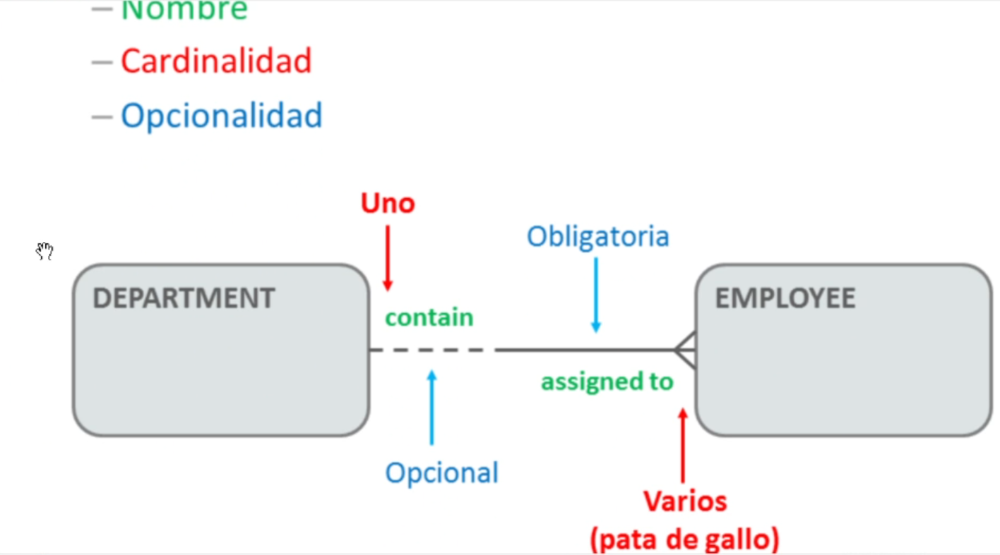

# 22-05 Notas Intro Clase
 + DDL definir datos; tablas
 + DML manipular / insertar datos

# Modelo Conceptual Ejercicio
+ Posibles entidades:
    + equipo   
    + pedido 
    + cliente
    + articulo
    + representante

# Tipos entidades
+ Principal: **independiente**

+ Característica: **dependiente de una entidad principal**

+ Intersección: **dependiente de DOS entiedades**

# Instancia
+ Única incidencia de una entidad
    + ENTIDAD | INSTANCIA
    + Person  | John Smith
    + Product | Unia
# Relación
+ Si la linea es continua la relación es obligatoria -depende de donde sale-
+ Si la linea es discotinua la relación es opcional -no dependo de x-
 